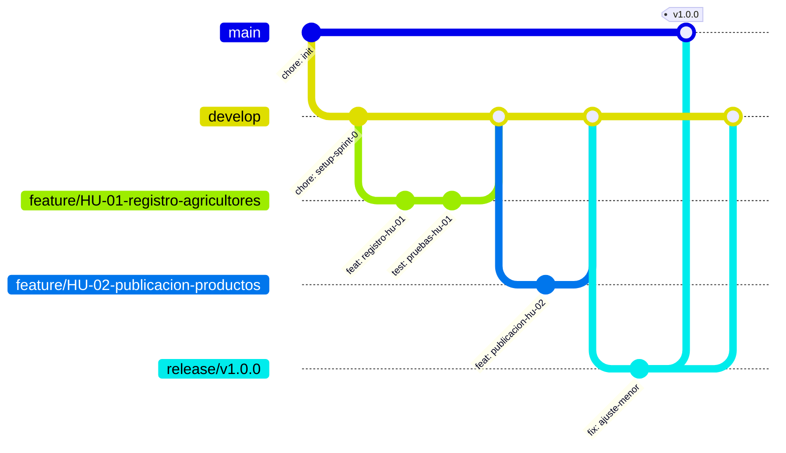

# AgroValle Connect


[](https://github.com/JuanDavidVM/AgroValle-Connect/actions/workflows/ci.yml)

> Proyecto integrador — **Ingeniería de Software II**
> Institución Universitaria Antonio José Camacho (UNIAJC)
> Docente: Paola Andrea Bedoya Toro

---

## 1. Descripción

AgroValle Connect es una aplicación web empresarial desarrollada en **Java 17 / Spring Boot** que elimina la intermediación innecesaria en la cadena de comercialización agrícola, conectando directamente la oferta de las fincas del Valle del Cauca con la demanda comercial urbana de Cali y sus alrededores.

**Módulos principales del sistema:**

| Módulo | Responsabilidad |
|--------|-----------------|
| Productores y Ofertas | Registro de fincas por municipio y publicación de lotes de cosecha (cantidad en kg, precio unitario, categoría y fecha estimada de recolección). |
| Catálogo y Búsqueda Inteligente | Filtrado de la oferta por municipio de origen, categoría y disponibilidad; consulta de precios promedio regionales. |
| Pedidos Directos y Stock | Reserva de inventario, consolidación de carritos y emisión de órdenes de compra directas a precio justo. |
| Logística y Trazabilidad | Confirmación de alistamiento del lote, programación de la ruta de despacho y seguimiento para el comprador. |

---

## 2. Problemática

El Valle del Cauca es una despensa agrícola de Colombia, con municipios de alta vocación como **Dagua, Palmira, Buga, Tuluá, Caicedonia y Jamundí**. Sin embargo, la cadena de comercialización tradicional presenta tres fallas estructurales:

1. **Intermediación excesiva (cadenas largas).** Los pequeños y medianos agricultores venden a intermediarios locales a precios muy bajos. Cuando el producto llega a centrales de abasto como Cavasa o a restaurantes y comercios urbanos de Cali, el precio se ha multiplicado, perjudicando tanto al productor como al comprador final.

2. **Falta de visibilidad de la oferta en tiempo real.** No existe una plataforma centralizada que permita a un comerciante urbano saber qué se está cosechando esta semana en Dagua o Palmira, en qué cantidades ni a qué precios.

3. **Inexistencia de trazabilidad y programación logística.** Los despachos se hacen sin coordinación previa, generando pérdidas poscosecha por tiempos de espera prolongados o falta de transporte adecuado.

---

## 3. Declaración de Visión del Producto

> **Para** los productores del Valle
> **Que** necesitan vender directamente,
> **AgroValle Connect** es una plataforma web en Java
> **Que** conecta oferta y demanda a precio justo,
> **A diferencia de** los intermediarios tradicionales,
> **Nuestro producto** garantiza trazabilidad y contratos de API transparentes.

---

## 4. Integrantes del equipo

| Nombre completo | Usuario GitHub | Rol |
|-----------------|----------------|-----|
| Juan David Vidal Muñoz | `@JuanDavidVM` | Product Owner |
| Robert Andres Preciado | `@RR23desing` | Scrum Master |
| Juan Esteban Quintero Berrio | `@JuanQuintero233` | QA |
| Juan David Gonzales Mendez | `@JMendez222` | QA |

---

## 5. Tecnologías

| Categoría | Tecnología |
|-----------|------------|
| Lenguaje | Java 17 (LTS) |
| Framework | Spring Boot 3.3.4 (Web, Validation, Data JPA) |
| Gestor de dependencias | Maven |
| Base de datos | PostgreSQL 16 (H2 en memoria para pruebas) |
| Pruebas | JUnit 5, Spring Boot Test, MockMvc |
| Cobertura | JaCoCo (mínimo 60%) |
| Análisis estático | Checkstyle (Google Java Style adaptado) |
| Hooks de calidad | Husky |
| CI/CD | GitHub Actions |
| Control de versiones | Git + GitHub (GitFlow) |

**Patrón arquitectónico:** estructuración estricta en capas bajo **MVC**.
**Patrones de diseño (GoF) previstos:** *Repository* (acceso a datos), *Factory* (creación de tipos de usuario y de órdenes), *Observer* (notificaciones de estado de pedidos) y *Singleton* (conexiones y configuraciones).

---

## 6. Estructura inicial del proyecto

```
agrovalle-connect/
├── .github/
│   ├── workflows/ci.yml            # Pipeline de Integración Continua
│   └── pull_request_template.md    # Plantilla de PR con checklist del DoD
├── .husky/
│   ├── pre-commit                  # Bloquea el commit si falla Checkstyle o los tests
│   └── commit-msg                  # Valida el formato Conventional Commits
├── docs/
│   ├── dod.md                      # Definition of Done firmado por el equipo
│   └── adr/
│       └── ADR-001-estrategia-de-ramificacion.md
├── src/
│   ├── main/
│   │   ├── java/co/edu/uniajc/agrovalle/
│   │   │   ├── AgroValleConnectApplication.java
│   │   │   ├── controller/         # Capa de control (MVC)
│   │   │   └── dto/                # Contratos de entrada/salida de la API
│   │   └── resources/
│   │       └── application.yml
│   └── test/
│       ├── java/co/edu/uniajc/agrovalle/
│       └── resources/application-test.yml
├── .gitignore
├── BACKLOG.md                      # 15 Historias de Usuario con MoSCoW, BDD y Story Points
├── README.md
├── checkstyle.xml
├── checkstyle-suppressions.xml
├── package.json                    # Solo para gestionar Husky
└── pom.xml
```

Durante el Sprint 0 el código fuente se limita a un endpoint de verificación de estado (`GET /api/v1/health`). Su única función es comprobar que la estructura Maven, el contexto de Spring Boot, la suite de pruebas y el pipeline funcionan de extremo a extremo **antes** de escribir lógica de negocio.

---

## 7. Estrategia de ramificación: GitFlow

```
main                    Rama protegida. Solo recibe versiones estables mediante release/.
develop                 Rama de integración. Reúne las historias completadas.
feature/HU-XX-nombre    Una rama por Historia de Usuario. Nace y muere en develop.
release/vX.X.X          Estabilización de un incremento antes de publicarlo en main.
hotfix/vX.X.Y           Corrección urgente sobre producción (nace de main).
```

**Reglas del equipo:**

- Nadie programa directamente sobre `main` ni sobre `develop`.
- Todo cambio funcional se desarrolla en una rama `feature/HU-XX-*`.
- Todo cambio que llegue a una rama principal lo hace mediante **Pull Request**.
- Todo Pull Request requiere **revisión y aprobación de al menos un compañero**.
- El autor no aprueba su propio PR.
- La rama remota se elimina después del merge.

### 7.1. Justificación de GitFlow

La Guía de Trabajo Práctico plantea dos alternativas. El equipo eligió GitFlow por tres razones:

1. **Evita romper la línea principal.** Trunk-Based Development exige integración continua real y disciplina extrema con ramas de vida muy corta; sin un pipeline de CI activo desde el primer día (se habilita plenamente en la Sesión 10), un error integrado directamente dejaría a todo el equipo bloqueado. GitFlow aísla ese riesgo dentro de la rama de cada historia.

2. **Se ajusta a entregas versionadas.** El curso evalúa incrementos por sesión. Las ramas `release/vX.X.X` permiten congelar y estabilizar exactamente lo que se entrega, manteniendo `main` siempre desplegable y etiquetada con versionamiento semántico.

3. **Hace natural el Peer Review.** Una rama por Historia de Usuario produce Pull Requests pequeños y enfocados, que se revisan en minutos en lugar de horas — justo lo que exige el criterio 3 de la rúbrica.

**Mitigación del riesgo conocido.** GitFlow puede acumular deuda por integración tardía. El equipo lo neutraliza con dos políticas: las ramas de feature viven como máximo una sesión de trabajo, y es obligatorio sincronizar con `develop` (`git merge develop`) antes de abrir el Pull Request. Así los conflictos se resuelven en la rama del autor y nunca en la rama de integración.

El registro formal de esta decisión está en [`docs/adr/ADR-001-estrategia-de-ramificacion.md`](docs/adr/ADR-001-estrategia-de-ramificacion.md).

### 7.2. Diagrama de ramificación (Mermaid)



---

## 8. Convención de commits

Se aplica el estándar **Conventional Commits**, vinculado a versionamiento semántico (SemVer):

| Tipo | Uso | Impacto en la versión |
|------|-----|-----------------------|
| `feat` | Nueva funcionalidad | MINOR (x.**1**.0) |
| `fix` | Corrección de un error | PATCH (x.0.**1**) |
| `docs` | Documentación | Ninguno |
| `test` | Pruebas automatizadas | Ninguno |
| `refactor` | Reorganización sin cambio de comportamiento | Ninguno |
| `style` | Formato y estilo | Ninguno |
| `chore` | Configuración y tareas de mantenimiento | Ninguno |
| `ci` | Pipeline de integración continua | Ninguno |
| `BREAKING CHANGE` | Rompe compatibilidad | MAJOR (**1**.0.0) |

**Ejemplos válidos en este proyecto:**

```
feat(auth): implementar registro de agricultores
fix(auth): corregir validación de credenciales
test(auth): agregar pruebas de registro
docs(readme): documentar estrategia GitFlow
chore(config): configurar Checkstyle
refactor(user): reorganizar servicio de usuarios
feat(api): implementar @RestController para registro de agricultores
fix(persistence): corregir mapeo de @OneToMany en entidad Finca
```

**Mensajes prohibidos:** `cambios`, `avance`, `update`, `final`, `subiendo`, `arreglo`, `prueba`, `arreglado el problema del repo`.

El hook `.husky/commit-msg` rechaza automáticamente cualquier mensaje fuera del estándar.

---

## 9. Instrucciones para ejecutar el proyecto

**Requisitos previos:** JDK 17, Maven 3.9+, PostgreSQL 16, Node.js 18+ (solo para Husky), Git.

```bash
# 1. Clonar el repositorio
git clone git@github.com:JuanDavidVM/AgroValle-Connect.git
cd agrovalle-connect

# 2. Instalar los hooks de calidad (una sola vez por máquina)
npm install

# 3. Crear la base de datos local
createdb agrovalle

# 4. Compilar y ejecutar la suite de pruebas
mvn clean test

# 5. Levantar la aplicación
mvn spring-boot:run

# 6. Verificar que responde
curl http://localhost:8080/api/v1/health
# {"status":"UP","service":"agrovalle-connect","version":"0.1.0-SNAPSHOT"}
```

La conexión a base de datos se configura por variables de entorno (`DB_URL`, `DB_USER`, `DB_PASSWORD`). **Nunca** se versionan credenciales.

### Flujo de trabajo diario

```bash
git checkout develop && git pull origin develop
git checkout -b feature/HU-01-registro-agricultores
# ... desarrollo y commits semánticos ...
git merge develop                 # sincronizar antes del PR
git push origin feature/HU-01-registro-agricultores
# Abrir el Pull Request hacia develop y asignar un revisor
```

---

## 10. Configuración de calidad

| Control | Herramienta | Comando | Umbral |
|---------|-------------|---------|--------|
| Estilo estático | Checkstyle | `mvn checkstyle:check` | Cero advertencias |
| Pruebas | JUnit 5 | `mvn clean test` | 100% en verde |
| Cobertura | JaCoCo | `mvn verify` | ≥ 60% de líneas |
| Todo el DoD técnico | Maven | `mvn clean verify` | `BUILD SUCCESS` |

**Mitigación de deuda técnica.** Husky y Checkstyle se configuraron **antes** de escribir la primera línea de lógica de negocio, y no después. La diferencia es determinante: cuando el linter llega al final de un proyecto, el equipo enfrenta cientos de violaciones acumuladas y termina desactivando reglas para poder entregar. Al instalarlo en el Sprint 0, cada commit nace limpio y el costo de cumplir la norma es marginal.

El hook `.husky/pre-commit` ejecuta `mvn checkstyle:check` y `mvn test`, e **impide el commit** si cualquiera de los dos falla. El hook `.husky/commit-msg` valida el formato del mensaje. El resultado es que el código defectuoso ni siquiera alcanza el repositorio local, mucho menos el remoto: la calidad deja de ser un accidente y pasa a ser una política explícita, verificable y automatizada.

---

## 11. Definition of Done

El contrato técnico completo, con su checklist de cumplimiento obligatorio y la firma formal del equipo, está en **[`docs/dod.md`](docs/dod.md)**.

Resumen de las ocho condiciones innegociables: Build Local · Checkstyle sin advertencias · 100% de pruebas en verde con cobertura ≥ 60% · Peer Review aprobado por un par · Documentación actualizada · Conventional Commits · Hooks de Husky activos · Criterios de aceptación BDD verificados.

---

## 12. Product Backlog

Las **15 Historias de Usuario** priorizadas con MoSCoW, especificadas con BDD (Given–When–Then) y estimadas en Story Points mediante Planning Poker están en **[`BACKLOG.md`](BACKLOG.md)**.
